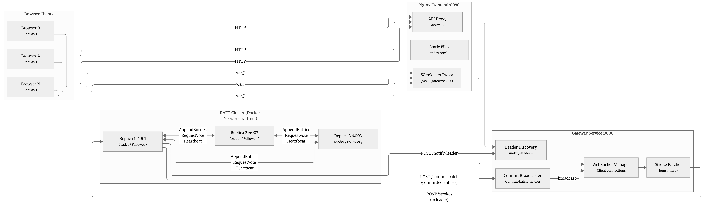
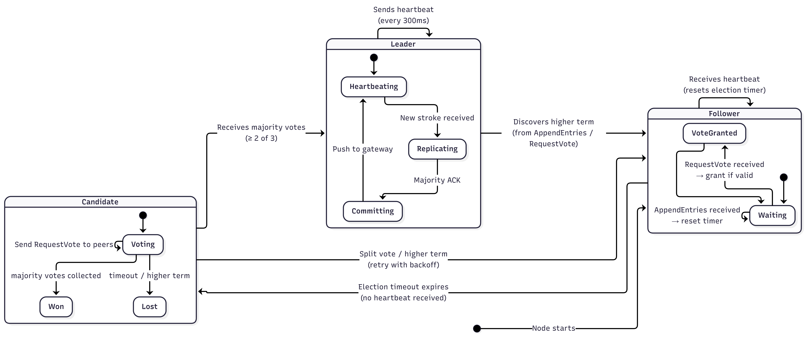
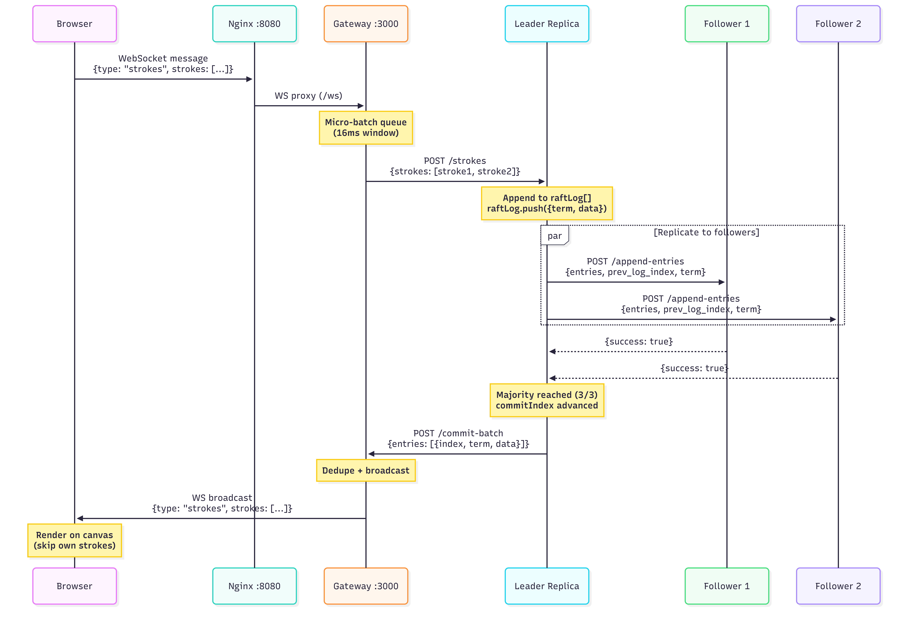
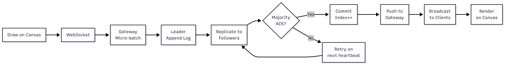
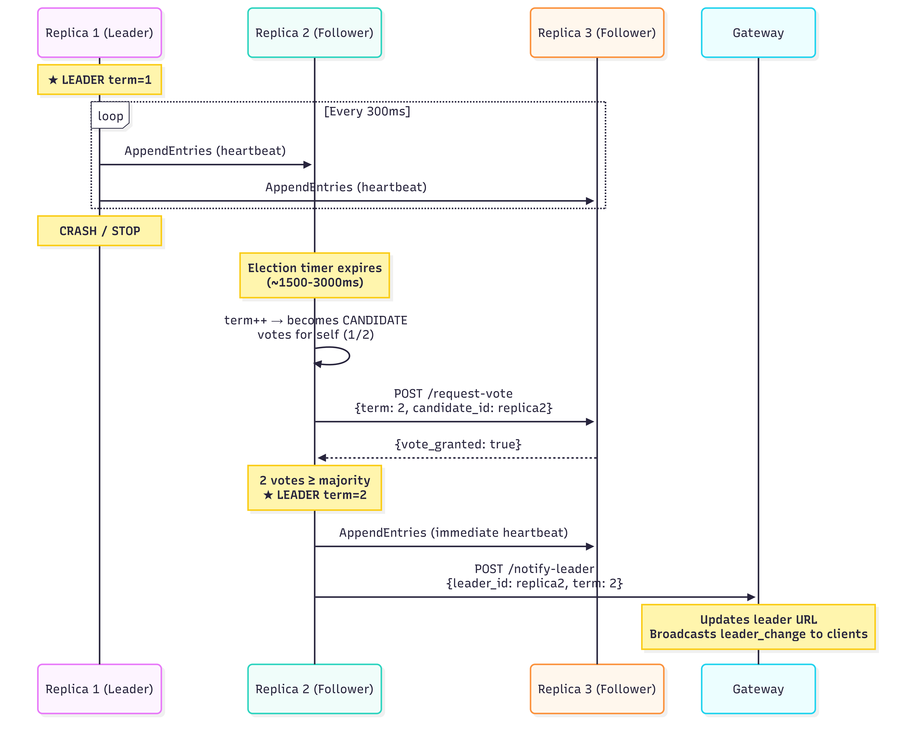

# Distributed Real-Time Drawing Board with Mini-RAFT Consensus

> Cloud Computing Assignment  
> JavaScript (Node.js) · Express · Docker · WebSocket · Mini-RAFT

A fault-tolerant collaborative drawing board where multiple users draw on a shared HTML5 canvas in real time. The backend is a cluster of **3 replica nodes** that maintain a shared stroke log using a **Mini-RAFT consensus protocol**. Even if a node crashes or restarts, the system stays live and the canvas stays consistent.

---

## Architecture



### Services

| Service | Port | Description |
|---|---|---|
| `frontend` | 8080 | Nginx - serves canvas UI + dashboard, proxies `/ws` and `/api/` to gateway |
| `gateway` | 3000 | Node.js WebSocket server - routes stroke batches to leader, broadcasts commits |
| `replica1` | 4001 | RAFT node - leader or follower |
| `replica2` | 4002 | RAFT node - leader or follower |
| `replica3` | 4003 | RAFT node - leader or follower |

> All three replicas run the **same Docker image** (`./replica`), with independent bind-mounted hot-reload folders (`./replica1`, `./replica2`, `./replica3`) and distinct environment variables.

---

## Mini-RAFT Protocol

### RAFT State Machine



Each node transitions between three states:

- **Follower** - waits for leader heartbeats, grants votes
- **Candidate** - initiates elections after heartbeat timeout
- **Leader** - handles log replication, commits, and client strokes

### Timing

| Parameter | Value |
|---|---|
| Election timeout | Random 1500–3000 ms (staggered per replica ID) |
| Heartbeat interval | 300 ms |
| RPC timeout | 1500 ms |
| Majority (3 nodes) | 2 of 3 |

### Stroke Commit Flow



1. Browser sends stroke over WebSocket → Nginx → Gateway
2. Gateway forwards micro-batches to Leader via `POST /strokes`
3. Leader appends entry to its local log as `{term, data}`
4. Leader immediately sends `AppendEntries` to both followers concurrently
5. Once the leader + at least 1 follower have the entry (majority = 2 of 3), the leader advances `commit_index`
6. Leader's `pushCommits()` fires `POST /commit-batch` to Gateway
7. Gateway broadcasts committed stroke batches to all connected WebSocket clients

### Data Flow Overview



### Catch-up Sync (Restarted Node)

1. Node restarts as Follower and receives `AppendEntries`
2. If `prev_log_index` fails, follower returns `success: false` with `conflict_index`
3. Follower calls `POST /sync-log` to the leader with `from_index`
4. Leader responds with committed entries from that index onward
5. Follower appends missing entries, updates `commit_index`, and resumes normal replication

---

## Project Structure

```
project-root/
├── docker-compose.yml          # 5-service stack with health checks
├── README.md                   # This file
├── ARCHITECTURE.md             # Detailed architecture document
├── DIAGRAMS.md                 # Mermaid diagram source code
├── frontend/
│   ├── Dockerfile              # nginx:alpine image
│   ├── nginx.conf              # WS proxy + API rewrite + static files
│   ├── index.html              # Collaborative whiteboard canvas
│   └── dashboard.html          # Cluster monitoring dashboard
├── gateway/
│   ├── Dockerfile              # node:20-alpine
│   ├── package.json
│   └── server.js               # WebSocket hub + leader routing + dashboard API
├── replica/
│   ├── Dockerfile              # node:20-alpine with --watch
│   ├── package.json
│   └── server.js               # Base RAFT implementation (~420 lines)
├── replica1/
│   └── server.js               # Bind-mounted hot-reload source for replica1
├── replica2/
│   └── server.js               # Bind-mounted hot-reload source for replica2
├── replica3/
│   └── server.js               # Bind-mounted hot-reload source for replica3
├── logs/
│   └── cluster_logs.txt        # Captured failover event logs
└── docs-and-reference/
    ├── MiniRAFT.pdf            # Assignment specification
    ├── Architecture.png        # System architecture diagram
    ├── CommitFlow.png          # Stroke commit sequence diagram
    ├── DataFlow.png            # Data flow overview
    ├── LeaderElection.png      # Leader failover sequence
    └── RAFT.png                # RAFT state machine diagram
```

---

## Getting Started

### Prerequisites

- Docker
- Docker Compose

### Run

```bash
git clone <your-repo-url>
cd project-root
docker-compose up --build -d
```

Open **http://localhost:8080** in multiple browser tabs and start drawing.

### Use from Different Laptops (Same LAN)

1. Run the stack on one host machine:
   ```bash
   docker-compose up --build -d
   ```
2. Find the host's LAN IP:
   ```bash
   # Windows
   ipconfig
   # Linux/Mac
   ip addr
   ```
3. Ensure inbound TCP port `8080` is allowed in the host firewall.
4. On each other laptop (same Wi-Fi/LAN), open:
   ```
   http://<HOST_LAN_IP>:8080
   ```
5. Draw from multiple laptops - all clients share the same board through the single gateway.

> **Note:** The frontend auto-detects `ws://` or `wss://` based on page protocol. Clients do not need direct access to replica ports (`4001-4003`) for normal usage.

### Stop

```bash
docker-compose down
```

---

## Frontend Features

| Feature | Description |
|---------|-------------|
| **Freehand Draw** | Pen tool with adjustable brush size and color picker |
| **Eraser** | Canvas eraser with `globalCompositeOperation: destination-out` |
| **Color Picker** | Full color spectrum with hex code display |
| **Brush Size** | Adjustable 1–20px slider |
| **Undo** | Canvas snapshot stack (up to 15 levels) |
| **Clear** | Local clear or replicated clear (broadcast to all clients) |
| **Export** | Download canvas as PNG image |
| **Session Panel** | Live display of leader, term, strokes, latency, and client ID |
| **Keyboard Shortcuts** | `P` pen · `E` eraser · `Ctrl+Z` undo |
| **Auto-Reconnect** | WebSocket reconnects automatically after 2s on disconnect |

---

## API Reference

### Replica Endpoints

| Method | Path | Purpose |
|---|---|---|
| `POST` | `/request-vote` | RequestVote RPC - grants vote if candidate log is up-to-date |
| `POST` | `/append-entries` | AppendEntries RPC - heartbeat + log replication + commit advance |
| `POST` | `/heartbeat` | Explicit heartbeat RPC for liveness + timer reset |
| `POST` | `/sync-log` | Returns committed entries from `from_index` onward (leader only) |
| `POST` | `/stroke` | Accept single stroke from gateway (leader only; returns 307 if not leader) |
| `POST` | `/strokes` | Accept batch of strokes from gateway (leader only) |
| `POST` | `/clear` | Append a replicated clear control entry (leader only) |
| `GET` | `/log` | Returns committed stroke data after the latest clear marker |
| `GET` | `/status` | Returns `id`, `role`, `term`, `leader_id`, `log_length`, `commit_index` |

### Gateway Endpoints

| Method | Path | Purpose |
|---|---|---|
| `WS` | `/ws` | Browser WebSocket - receives strokes, broadcasts commits |
| `POST` | `/commit` | Receive committed entry from leader - broadcast stroke or clear |
| `POST` | `/commit-batch` | Receive committed entry batches from leader |
| `POST` | `/notify-leader` | Newly elected leader registers itself with gateway |
| `POST` | `/clear` | Broadcast canvas clear to all clients |
| `GET` | `/status` | Returns current leader URL, connected clients, term |
| `GET` | `/dashboard-data` | Aggregated cluster data for monitoring dashboard |

---

## Failure Testing

### Leader Failover



```bash
# Kill the leader - watch automatic failover
docker-compose stop replica1

# Restart it - watch catch-up sync via /sync-log + AppendEntries
docker-compose start replica1

# Watch RAFT logs live
docker-compose logs -f replica1 replica2 replica3

# Check cluster state from each node
curl localhost:4001/status
curl localhost:4002/status
curl localhost:4003/status

# Check gateway state
curl localhost:3000/status
```

### Sample Failover Log Output

```
replica2  | ELECTION term=1
replica2  | Vote granted by http://replica1:4001 term=1 (2/2)
replica2  | LEADER term=1
replica2  | Notified gateway of leadership
replica1  | Voted for replica2 term=1
replica3  | Voted for replica2 term=1
```

### Failure Scenarios

| Scenario | System Behavior |
|----------|----------------|
| **Leader crash** | Followers' election timers expire (1.5-3s). One becomes candidate, wins election. Gateway discovers new leader. Clients never disconnected. |
| **Follower crash** | Leader continues with remaining follower. Majority still achievable. Restarted follower catches up via `/sync-log`. |
| **Gateway restart** | All WebSocket clients auto-reconnect (2s delay). Gateway re-discovers leader and replays committed log. |
| **Hot reload (file edit)** | `node --watch` restarts the process. Container stays running. RAFT election happens automatically. |
| **Rapid successive failures** | Exponential backoff on split votes prevents election storms. System stabilizes within a few terms. |

---

## Tech Stack

| Layer | Technology |
|---|---|
| Frontend | HTML5 Canvas + Vanilla JS + WebSocket API |
| Frontend server | Nginx Alpine |
| Gateway | Node.js 20 + Express + ws (WebSocket) |
| Replica nodes | Node.js 20 + Express + axios |
| Hot reload | `node --watch` (built-in) |
| Containerisation | Docker + Docker Compose |

---

## Cloud Concepts Demonstrated

| Concept | Implementation |
|---|---|
| **Consensus Protocol** | Mini-RAFT - leader election + log replication + majority commit |
| **Fault Tolerance** | Survives any single node failure; automatic leader re-election |
| **Log Catch-up** | Fast-backup via `conflict_index` plus explicit `/sync-log` catch-up |
| **State Replication** | Append-only stroke log, majority commit before broadcast |
| **Service Discovery** | Gateway polls `/status` to find leader; notified via `/notify-leader` on election |
| **Real-Time Collaboration** | WebSocket broadcast to all clients on every committed stroke |
| **Containerisation** | 5-service docker-compose stack (1 shared replica image, 3 instances) |
| **Zero-Downtime** | Bind-mounted hot reload, `node --watch`, `restart: unless-stopped` |
| **Observability** | Console logs for elections/votes/commits + live monitoring dashboard |

---

## Bonus Features Implemented

| Bonus (from PDF §11) | Status |
|---|---|
| Dashboard showing leader, term, log sizes | Implemented at `/dashboard` |
| Stroke batching for performance | Gateway micro-batching + batch API |
| Eraser and undo support | Canvas eraser tool + snapshot undo stack |

---

## Documentation

| Document | Description |
|----------|-------------|
| [ARCHITECTURE.md](ARCHITECTURE.md) | Detailed architecture document (API specs, failure handling, integration logs) |
| [DIAGRAMS.md](DIAGRAMS.md) | Mermaid source code for all diagrams |
| [docs-and-reference/MiniRAFT.pdf](docs-and-reference/MiniRAFT.pdf) | Original assignment specification |
| [logs/cluster_logs.txt](logs/cluster_logs.txt) | Captured failover event logs |